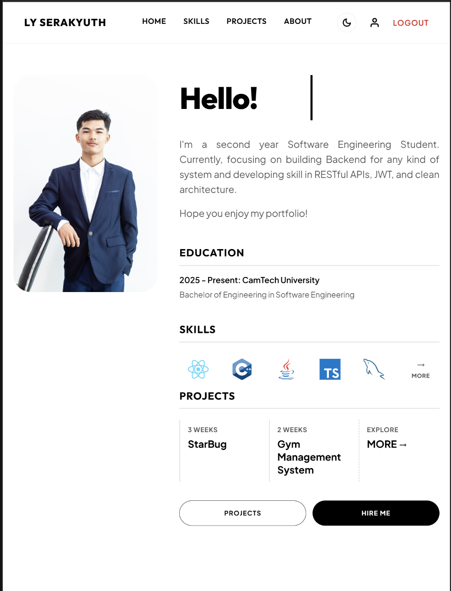
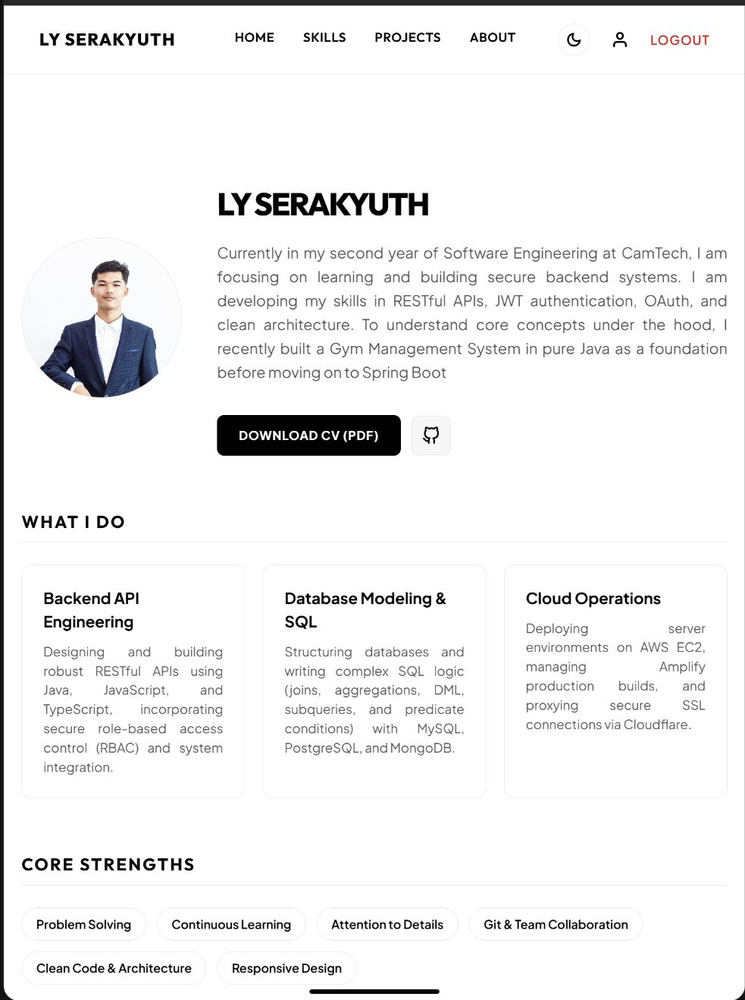
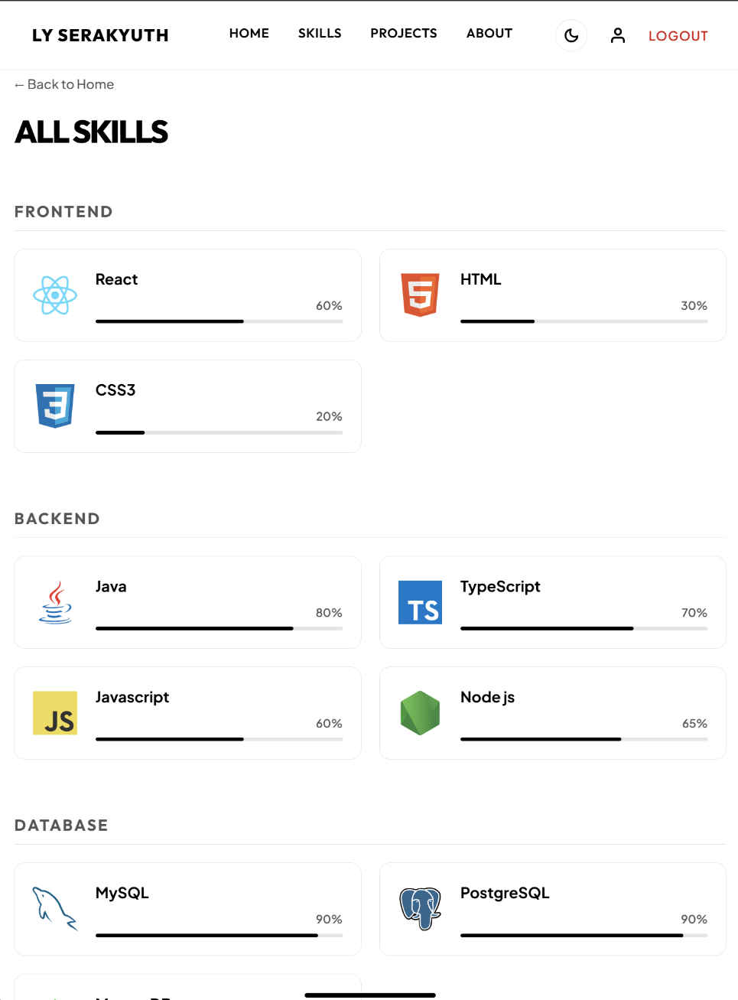
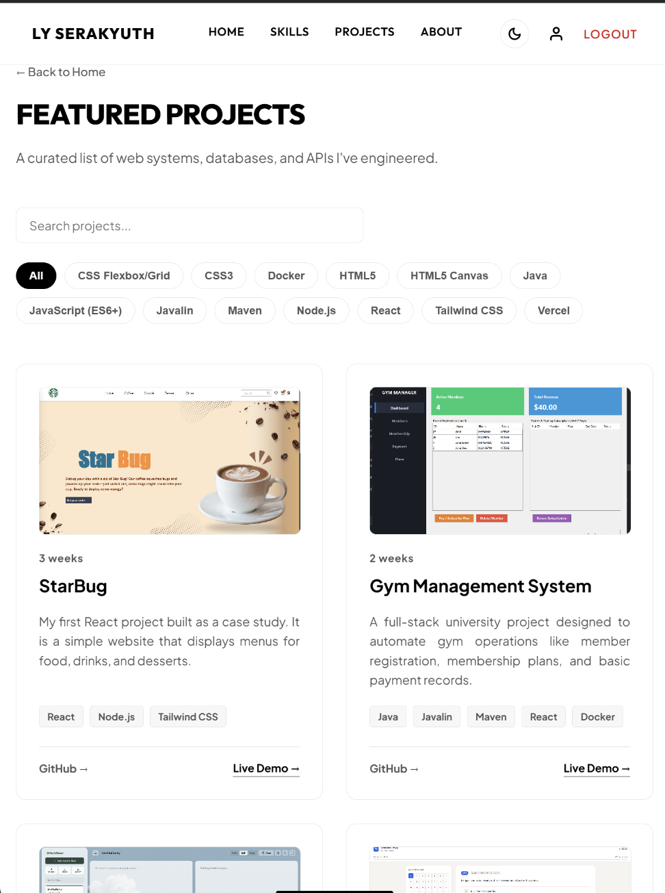
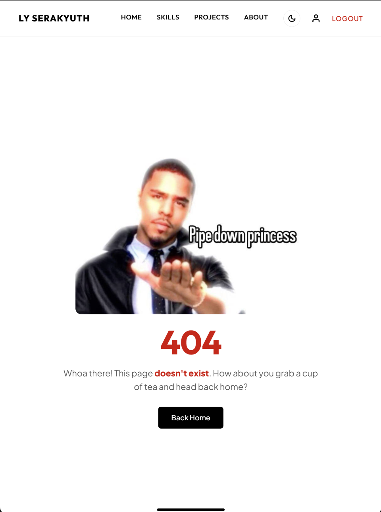

# Personal Portfolio Website

I designed and developed this full-stack web portfolio as my final assessment project. It demonstrates my software engineering capabilities using the MERN stack (MongoDB, Express, React, Node.js) and cloud deployment on AWS.

## Project Overview

I built this portfolio to showcase my technical skills, academic milestones, and coding projects to recruiters, internship coordinators, and instructors. The application features a fully responsive public portal for visitors and a private administrative dashboard that gives me full CRUD control over my data.

## Main Features

### Public Portal (Visitor Interface)
* **Landing Page:** Introduces me with my bio, professional title, and dynamic typewriter animations.
* **About and Education:** Displays my educational background and milestones on an interactive scroll-linked timeline.
* **Skills Directory:** Categorizes and showcases my proficiencies in programming languages, databases, cloud, and tools.
* **Projects Catalog:** Pulls my projects dynamically from MongoDB, detailing the description, tech stack, individual contribution, challenges faced, and lessons learned.
* **Contact Form:** Validates visitor inputs client-side and transmits message records to the database.

### Administrative Console
* **Admin Login:** Secured via custom credentials authentication.
* **Protected Routes:** Governed by client-side React Router navigation guards.
* **Data Management:** I can Add, Edit, and Delete projects, skills, and education history directly from the dashboard.
* **Inquiries Panel:** A private dashboard page where I can read messages submitted by visitors.

## Technologies Used

* **Frontend:** React, React Router Dom, Axios, CSS Variables
* **Backend:** Node.js, Express, JSON Web Tokens (JWT), CORS
* **Database:** MongoDB Atlas, Mongoose
* **Deployment & Cloud Operations:** AWS Amplify (Frontend Hosting), AWS EC2 (Backend Hosting), Nginx (Reverse Proxy), PM2 (Process Management), Cloudflare (DNS and SSL)
* **Development Tools:** Git, GitHub, npm

## Application Architecture

I deployed the application using a split-hosting architecture to maximize loading speed and security. Below is the deployment architecture of my system:


* **Frontend Hosting:** I built and deployed my React client on AWS Amplify. Amplify stores the static files in an S3 Bucket and distributes them globally via the CloudFront CDN. I configured a custom rewrite rule to route client-side URLs to index.html, allowing React Router to handle page refreshes without server errors.
* **Backend Hosting:** My Node.js/Express API server is hosted on an AWS EC2 instance running Ubuntu.
* **Process Manager:** I installed PM2 on the EC2 instance to manage my Node.js application process, ensuring it stays active and automatically restarts if it crashes.
* **Reverse Proxy:** I configured Nginx as a reverse proxy on the EC2 instance to listen on port 80/443 and route incoming API requests to the internal Node.js process running on port 5000.
* **Database:** I used MongoDB Atlas as my cloud database cluster, which connects to my backend server via Mongoose.

## Installation Instructions

### Prerequisites
* Node.js (v16 or higher)
* MongoDB (Local instance or MongoDB Atlas URI)
* Git

### Step-by-Step Installation

1. **Clone the repository:**
   ```bash
   git clone https://github.com/Brotheryuth/Ly-Serakyuth-portfolio.git
   cd Ly-Serakyuth-portfolio
   ```

2. **Configure environment variables:**
   Configure environment files for both frontend and backend directories (see the Environment Variables section below).

3. **Set up the backend:**
   ```bash
   cd backend
   npm install
   npm run dev
   ```

4. **Set up the frontend:**
   ```bash
   cd ../frontend
   npm install
   npm run dev
   ```

## Environment Variable Instructions

### Backend Configuration
Create a `.env` file in the `backend` folder:
```env
PORT=5000
MONGO_URI=your_mongodb_connection_string
JWT_SECRET=your_secret_passphrase
```

* `PORT`: The local port the Express server will run on (default is 5000).
* `MONGO_URI`: The connection string for the database (local or MongoDB Atlas).
* `JWT_SECRET`: A secure passphrase used to sign and verify JSON Web Tokens.

### Frontend Configuration
Create a `.env` file in the `frontend` folder:
```env
VITE_BACKEND_URL=http://localhost:5000
```

* `VITE_BACKEND_URL`: The base URL pointing to my running backend API server (use the local address for development, and the EC2 API domain for production).

## Production Configurations

### AWS Amplify Redirect Rule (React Router Catch-All)
I configured Amplify with a rewrite rule to redirect all client-side paths to the root HTML document:
* **Source address:** `</^[^.]+$|\.(?!(css|gif|ico|jpg|js|png|txt|svg|woff|woff2|ttf|map|json)$)([^.]+$)/>`
* **Target address:** `/index.html`
* **Type:** `200 (Rewrite)`

### Nginx Configuration (EC2 Reverse Proxy)
Here is the Nginx configuration block I created on my EC2 instance to direct API traffic to the running Node.js process:
```nginx
server {
    server_name api.ly-serakyuth-portfolio.space;

    location / {
        proxy_pass http://127.0.0.1:5000;
        proxy_http_version 1.1;
        proxy_set_header Upgrade $http_upgrade;
        proxy_set_header Connection 'upgrade';
        proxy_set_header Host $host;
        proxy_cache_bypass $http_upgrade;
        proxy_set_header X-Forwarded-For $proxy_add_x_forwarded_for;
    }
}
```

## Security Implementation
* **Stateless Authentication:** I secured my admin routes using JSON Web Tokens (JWT). When admin credentials match on the server, a signed token is generated using the private `JWT_SECRET`.
* **Axios Interceptors:** My React frontend caches the token in `localStorage`. A request interceptor automatically attaches the header `Authorization: Bearer <token>` to all backend requests.
* **Route Protection:** I wrote a custom backend middleware (`verifyAdmin`) that decodes the incoming token, checks the signature, and verifies role privileges before permitting database modifications.
* **Auto-Session Cleanup:** An Axios response interceptor redirects users back to `/login` and flushes `localStorage` if the API returns a 401 or 403 status.

## API Endpoint Summary

### Authentication Endpoints
* `POST /api/auth/login` - Authenticates administrative credentials and returns a JWT token.

### User Profile Endpoints
* `GET /api/user` - Retrieves my user profile information.
* `POST /api/user` - Creates or updates my user profile (Admin Only).

### Project Endpoints
* `GET /api/project` - Retrieves my projects stored in the database.
* `POST /api/project` - Adds a new project (Admin Only).
* `PUT /api/project/:id` - Updates project details by ID (Admin Only).
* `DELETE /api/project/:id` - Removes a project by ID (Admin Only).

### Skill Endpoints
* `GET /api/userSkill` - Retrieves the skills catalog.
* `POST /api/userSkill` - Adds a new skill (Admin Only).
* `DELETE /api/userSkill/:id` - Removes a skill by ID (Admin Only).

### Education Endpoints
* `GET /api/education` - Retrieves the list of education milestones.
* `POST /api/education` - Adds an education milestone (Admin Only).
* `PUT /api/education/:id` - Updates education details by ID (Admin Only).
* `DELETE /api/education/:id` - Removes an education milestone by ID (Admin Only).

### Message Endpoints
* `POST /api/message` - Submits a contact inquiry from a visitor.
* `GET /api/message` - Retrieves all submitted contact inquiries (Admin Only).

## Screenshots


*Figure 1: Home Page*


*Figure 2: About and Education Timeline*


*Figure 3: Skills Directory*


*Figure 4: Projects Showcase*


*Figure 5: Custom Not Found (404) Page*

## Live Website URL
My production application is deployed and accessible at:
* **Frontend Application:** `https://ly-serakyuth-portfolio.space`
* **Backend API Domain:** `https://api.ly-serakyuth-portfolio.space`

## GitHub Repository URL
My project source code is hosted on GitHub at:
* **Repository Link:** `https://github.com/Brotheryuth/Ly-Serakyuth-portfolio`

## Known Limitations
* **Single Admin Mode:** Currently supports only one static administrator account configured on backend initialization.
* **Token Expiration Handling:** Utilizes stateless JWT tokens that require full re-authentication when expired, instead of an active refresh token rotation system.
* **Database Caching:** Does not include Redis or memory caching, relying on direct queries to MongoDB Atlas for all reads.

## Future Improvements
* **Refresh Token Rotation:** Implementing rolling refresh tokens for a better administrator session experience.
* **Audit Logs:** Tracking administrative changes (inserts, edits, deletes) in a database log collection.
* **Expanded Media Storage:** Integrating Amazon S3 storage directly via backend controllers to upload and host project screenshots and avatars dynamically instead of utilizing local static directories.
* **Testing Coverage:** Adding Jest/Supertest integration tests for backend routes.

## Author Information
* **Student Name:** Ly Serakyuth
* **Course/Major:** Software Engineering Student
* **Academic Institution:** CamTech University
* **Email:** lyserakyuth06@gmail.com
* **LinkedIn:** [Your LinkedIn Link]
* **GitHub Profile:** `https://github.com/Brotheryuth`

---

## Development and Deployment Challenges Resolved

### 1. Cross-OS Case-Sensitivity Import Mismatches
* **Challenge:** My local Windows machine is case-insensitive, allowing mismatches between file naming and code imports to load without issue. However, when I pushed the code to the Linux filesystem on EC2, it threw execution errors because Linux enforces case-sensitivity.
* **Solution:** I normalized casing conventions across all backend files, ensuring imports in controllers, models, and routes exactly match their filename casing.

### 2. AWS Amplify CI/CD Role Configuration
* **Challenge:** The build agent threw error logs regarding the inability to assume the specified IAM role.
* **Solution:** I updated the trust relationship policy of the service role in AWS IAM to explicitly trust `amplify.amazonaws.com` and `codebuild.amazonaws.com`.

### 3. GitHub Webhook Setup Redirection
* **Challenge:** Renaming my GitHub repository broke the CI/CD pipeline link, causing Amplify to return webhook setup errors due to repository API redirections.
* **Solution:** I disconnected the branch in Amplify to protect the application record and the associated Cloudflare configurations, and connected a new branch referencing the new repository name.

### 4. Cloudflare CNAME and AWS Validation
* **Challenge:** Recreating the Amplify app generated a new CloudFront domain, which caused SSL errors. Additionally, proxy mode obscured the new CNAME target from the AWS SSL validation checks.
* **Solution:** I deleted the old records in Cloudflare, created new CNAME records mapped to the new CloudFront URL, temporarily set the records to DNS-only (Grey Cloud) to allow AWS validation checks to succeed, and re-enabled the proxy once the status turned active.
